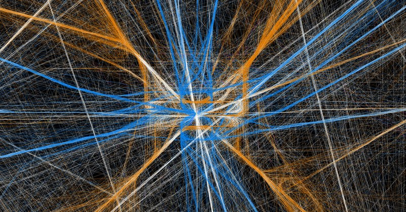

README
================
Anirudh Singh
5/19/2019

 <small>   <i>abstract</i> by
Nathalie Miebach is licensed under
<a href="https://www.ted.com/playlists/201/art_from_data">CC BY-SA
2.0</a>   </small>

# Portfolio of data displays

Anirudh Singh

# Introduction

This portfolio is done to meet the requirements for ME447:Data
Visualization which is taught at Rose-Hulman Institute of Technology.
The aim is to create clear, honest and effective presentation of data
using R and Rstudio.

# Displays and critiques

[Display 1](reports/d1-temp.md) Fifa19 Young Player Analysis

This is a box and whiskers plot made to find the most promising young
soccer players based on Potential and Nationality.

[Display 2](reports/d2-rep.md) BlackFriday Multiway Analysis This is a
multiway plot made to look at how age group and occupation affect your
purchasing power on Black Friday.

[Display 3](reports/d3-rep.md) Apple App Store Scatter Analysis This is
a scatter plot analysis of apps to see if support for additional
languages actually helps your popularity.

[Display 4](reports/d4-rep.md) Journalist Death Analysis This is a bar
plot analysis of all the journalists that have died since 1992.

[Display 5](reports/d5-rep.md) Recreating a Graphical Lie This is a line
plot to correct a graph that was shown on the news by Fox.

[Display 6](reports/d6-rep.md) Fifa19 Physical Attribute Analysis This
is a parallel coordinate analysis of the physical attributes of players
to look for defining qualities of attackers and defenders.

[Display 7](reports/d7-rep.md) Bank Survey Data Analysis This is a
diverging stacked bar plot made to find pain areas in internet banking
and ATM services

# Discussion Notes

[Reading responses](reports/reading-responses.md) Notes from the data
graphics literature on elements of design and visual rhetoric.

[Presentation prompts](reports/presentationResponses.md) Prompts that
question the decisions made during the creation of each visualization.

[Reflections on rhetoric](reports/reflections-rhetoric.md) Reflection on
the ideas of data journalists in discovering stories.
