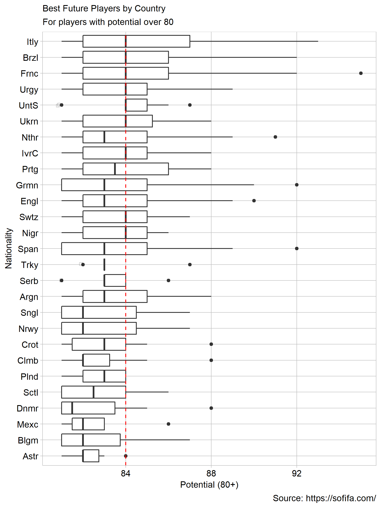

```{r}
library("knitr")  
opts_knit$set(root.dir = "../")  
opts_chunk$set(echo = FALSE)  
```


## Introduction
Soccer is a sport that dominates the world. There are an estimated 4 billion fans who watch this sport. FIFA19 is a popular videogame that updates weekly based on the player performances. It is the closest one can get to numerically defining a player. In the following display, I aim to look towards the future of the sport by looking at promising young players and try to gauge which country will end up with the best players.

## Requirements
This display meets requirements for D1.

- Observations :628 after cleaning
- Quantitative variable: Potential: indicator of how good the player can be (0-100)
- Qualitative variable: Nationality (27+ levels)

## Prose

```{r setup, echo=FALSE}
library("knitr")

```

*Display 1: Box plot of promising young players in FIFA19*


As an avid soccer fan, I have watched and played it for as long as I can remember. As long as I can remember, FIFA19 has dominated the market of soccer videogames since the early 2000s. The secret to the success is the player and club liscences which enable the videogame to be digital copy of the current teams out there. The Fifa World Cup just took place in 2018 and we saw France lift the trophy. The world cup is a pretty good indicator of how good a country's footballing institutions are. It sets the standard for the highest level of football with every country offering its best. I wanted to see which country will produce the next set of fantastic players by the time the next world cup comes around.

The dataset was huge with a lot of variables so I chose the ones that mattered the most. I chose the 'Potential' and the 'Nationality' as my main variables. I used 'ID','Age','Name' and 'Overall' to get my data in the desired format. I took the players with 'Potential'> 80 (above 80 classsifies as a great player). I also then took the players with 'Age'<23. I chose 23 because Under-23 is the last team a youth player can go to before being a part of the Senior team. I reordered the 'Nationality' variable with 'Potential' to make sure I get an ordered graph. This helps the viewer intuitively interpret the plot [@Robbins2013a, 217].

I chose to keep the outliers since I thought it would be interesting to see how many players from each country have the potential to be one of the greats (Messi,Ronaldo =94 overall). Although colour makes the graph more attractive, it did not make sense here since there are too many countries. After getting the players I removed the countries that have less than 5 80+ players since we are interested in seeing the best footballing institutions.

Looking at the graph we can see that Italy has a faily large number of players in the 82-87 category. It also has the largest range going from 81 - 94. Brazil and France are close with most of the players in the 82-85 region. Their range is from 81-92. I have drawn a red dotted line to compare the beginning of the boxes from the top to the bottom.  As we keep going lower the box plot shrinks and the ranges also shrink. When we compare to the FIFA official rankings it is not surprising to see that Italy, France, Brazil and Uraguay be 4 out of the Top 6 teams as we can see here as well. We can also see that France has a potential 'Messi' or 'Ronaldo' in its youth as seen with the outlier close to a 100. The surprise here was Ukraine as it is placed 27th but according it could be considered a favorite for the future. Ivory Coast is another one that is surprising. It ranks 65th but might still produce better players than a lot of European soccer giants.

The 'Potential' variable only gives us a rough idea of how great a player can get. it by no means is accurate. This graph is a good indicator of which footballing nations might gain prominence in the future. From the graph we can see that Ukraine, Ivory Coast and Nigeria might play a big part in the next World Cup as the young players mature.


## References

<div id="refs">https://www.fifa.com/fifa-world-ranking/ranking-table/men/</div>
