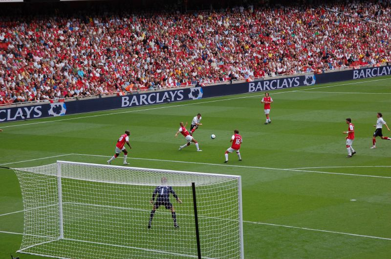

d1-temp2345
================
Anirudh Singh
March 22, 2019

 <small>   <i>Arsenal</i> by Nick Wadge, 2007 is licensed under <a href="https://creativecommons.org/licenses/by-nc/2.0/">CC0 1.0</a>   </small>

Displays and critiques
----------------------

[Display 1](reports/d1-temp.md) Title of your graph
State the type of graph (strip plot or box plot) and summarize the main points of the report.

Discussion notes
----------------

[Reading responses](reports/reading-responses.md) Notes from the data graphics literature on elements of design and visual rhetoric

try writing an equation
-----------------------

