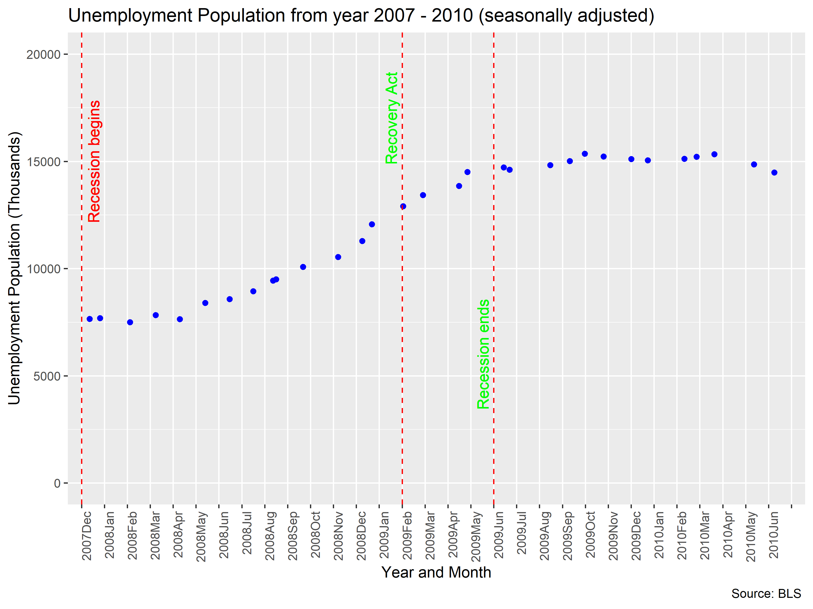

```{r}
library("knitr")  
opts_knit$set(root.dir = "../")  
opts_chunk$set(echo = FALSE)  
```


## Introduction
In today's world, the media makes the use of vizualizations to send their message to the audience. Often they make the use of biased and incorrect graphs to mislead the audience. I want to explore one such graph and do it right. The following visualization looks at unemployment rate in the US from 2007-10 and how it was represented on television. 

The phase from 2007 - 2010 caused major turmoil in the world financial market due to the recession in the US during that phase. With the country panicking about job security, FOX new presented the following graph to the audience. It is no surprise that every media outlet has a level of bias attached to it. Fox news has time and again proved itself to be biased and misleading.

```{r setup, echo=FALSE}
library("knitr")
include_graphics("../resources/unemployment.jpg")
```


*Display 1: Shows the graph shown on Television by Fox News*
## Requirements
This display meets requirements for D5.

- Observations :31 after cleaning
- Quantitative variable: unemployment Rate
- Other variable - MonthYear

-compelling story

## Prose

The first problem with this graph is the X axis, the spacing between the 4 labels is uneven numerically but the graph still shows it as equidistant. For this chart, Fox also ended up using the amount of people that are unemployed at that point and not the amount of people who have lost their jobs. The name of the chart is also very misleading since the scale does not represent quarters at all. We also do not know if this graph has been seasonally adjusted, since there are different forms of unemployment. Seasonal adjustment is a technique to remove influences of predictable seasonal patterns. This graph also does not start at 0 so we have no idea how the y scaling works. If we look at the rise in the graph, the distance between 7-9 and 13.5-15 is the same even though numericallly they are different. The distance between 9-13.5 is not proportional to the other distances.The title states that it represents job loss by quarter, the quarter are split up in groups of 3 months. Here we see that the difference between the X axis has different number of months. Hence not representing a quarter at all. By doing this the line between March 09 and June 10 ends up looking steeper than it actually is. 

Looking at all the drawbacks of the graph, we can say that none of these were accidental. The graph was meant to instill distrust for the government at that time which was Democratic. Obama also realeased certain policies to battle the recession in 2009. The uneven spacing of the X axis makes the user feel that the policy he put in place had no effect. It is safe to say that the viewer is manipulated and mislead. It is safe to say the guys at Fox news knew what they were doing.[@Wainer2000]

I'm sure there is another representation by enforcing the right comparisons in the graph[@Tufte]. In order to fix this, I took the actual data from the Bureau of Labor Statistics that gave me the unemployment rate based on month. Since we are looking at months and years on the X axis, I decided to represent the unemployment population monthly. This gives us a better understanding of the trend. I chose the data that had been seasonally adjusted. I also  I made another dataframe that includes the variable MonthYear which is a blend of the Month and Year and the rate.I decided to rename the graph to what it is actually representing. I made sure to let the viewer know that it has been seasonally adjusted. I also added 2 lines to indicate when the recession began and ended. Obama released the Recovery Act in Feb 2009 to rescue the economy. This has also been highlighted in the graph. I used the red colour to show the recession beginning to alert the audience. Green was used for positive aspects of the graph such as recession ending and the recovery act.


```{r setup2, echo=FALSE}
library("knitr")

```
*Display 2: Shows the corrected graph of the unemployment population from 2007 to 2010*

Analyzing this graph we can make some observations:
\n


* Recession phase : December 2007 - June 2010
In this phase we can see that there is a periodic rise in unemployment population. This is as expected since the recession leads to downsizing of businesses. We can see that the population went from close to 7.5M to around 15M by the time it ends.

* Recovery Act phase:
Obama administration came up with this Policy in February of 2010 to save the US economy. Although it took some months for it to come into effect. We do see it as effective. We can see that after the passing of the act, the unemployment population steadied at 15M and we can even see the slight recovery when we get to June 2010 when it starts to drop. This was precisely the fact that the previous misleading graph tried to hide. We can say that the Recovery act was successful and helped the economy.


Just like this example, there are graphs all around us that have been modified and manipulate to prey on our biases. Hopefully this example gave you an idea on what to look for to avoid being mislead.
 
## References
https://www.thebalance.com/what-was-obama-s-stimulus-package-3305625

https://www.thebalance.com/the-great-recession-of-2008-explanation-with-dates-4056832
