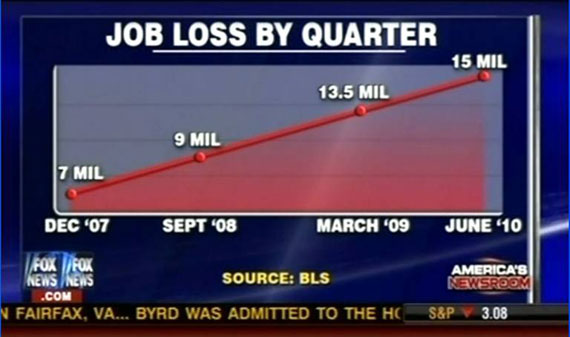
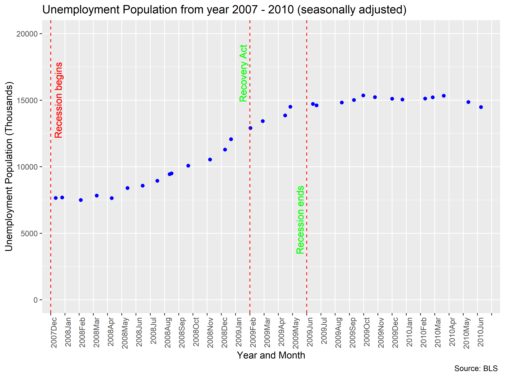

d5-report
================

``` r
library("knitr")  
opts_knit$set(root.dir = "../")  
opts_chunk$set(echo = FALSE)  
```

## Introduction

In today’s world, the media makes the use of vizualizations to send
their message to the audience. Often they make the use of biased and
incorrect graphs to mislead the audience. I want to explore one such
graph and do it right. The following visualization looks at unemployment
rate in the US from 2007-10 and how it was represented on television.

The phase from 2007 - 2010 caused major turmoil in the world financial
market due to the recession in the US during that phase. With the
country panicking about job security, FOX new presented the following
graph to the audience. It is no surprise that every media outlet has a
level of bias attached to it. Fox news has time and again proved itself
to be biased and misleading.

<!-- -->

*Display 1: Shows the graph shown on Television by Fox News* \#\#
Requirements This display meets requirements for D5.

  - Observations :31 after cleaning
  - Quantitative variable: unemployment Rate
  - Other variable - MonthYear

\-compelling story

## Prose

The first problem with this graph is the X axis, the spacing between the
4 labels is uneven numerically but the graph still shows it as
equidistant. For this chart, Fox also ended up using the amount of
people that are unemployed at that point and not the amount of people
who have lost their jobs. The name of the chart is also very misleading
since the scale does not represent quarters at all. We also do not know
if this graph has been seasonally adjusted, since there are different
forms of unemployment. Seasonal adjustment is a technique to remove
influences of predictable seasonal patterns. This graph also does not
start at 0 so we have no idea how the y scaling works. If we look at the
rise in the graph, the distance between 7-9 and 13.5-15 is the same even
though numericallly they are different. The distance between 9-13.5 is
not proportional to the other distances.The title states that it
represents job loss by quarter, the quarter are split up in groups of 3
months. Here we see that the difference between the X axis has different
number of months. Hence not representing a quarter at all. By doing this
the line between March 09 and June 10 ends up looking steeper than it
actually is.

Looking at all the drawbacks of the graph, we can say that none of these
were accidental. The graph was meant to instill distrust for the
government at that time which was Democratic. Obama also realeased
certain policies to battle the recession in 2009. The uneven spacing of
the X axis makes the user feel that the policy he put in place had no
effect. It is safe to say that the viewer is manipulated and mislead. It
is safe to say the guys at Fox news knew what they were doing.(Wainer,
[2000](#ref-Wainer2000))

I’m sure there is another representation by enforcing the right
comparisons in the graph(Tufte, [1983](#ref-Tufte)). In order to fix
this, I took the actual data from the Bureau of Labor Statistics that
gave me the unemployment rate based on month. Since we are looking at
months and years on the X axis, I decided to represent the unemployment
population monthly. This gives us a better understanding of the trend. I
chose the data that had been seasonally adjusted. I also I made another
dataframe that includes the variable MonthYear which is a blend of the
Month and Year and the rate.I decided to rename the graph to what it is
actually representing. I made sure to let the viewer know that it has
been seasonally adjusted. I also added 2 lines to indicate when the
recession began and ended. Obama released the Recovery Act in Feb 2009
to rescue the economy. This has also been highlighted in the graph. I
used the red colour to show the recession beginning to alert the
audience. Green was used for positive aspects of the graph such as
recession ending and the recovery act.

<!-- --> *Display 2: Shows the
corrected graph of the unemployment population from 2007 to 2010*

Analyzing this graph we can make some observations: 

  - Recession phase : December 2007 - June 2010 In this phase we can see
    that there is a periodic rise in unemployment population. This is as
    expected since the recession leads to downsizing of businesses. We
    can see that the population went from close to 7.5M to around 15M by
    the time it ends.

  - Recovery Act phase: Obama administration came up with this Policy in
    February of 2010 to save the US economy. Although it took some
    months for it to come into effect. We do see it as effective. We can
    see that after the passing of the act, the unemployment population
    steadied at 15M and we can even see the slight recovery when we get
    to June 2010 when it starts to drop. This was precisely the fact
    that the previous misleading graph tried to hide. We can say that
    the Recovery act was successful and helped the economy.

Just like this example, there are graphs all around us that have been
modified and manipulate to prey on our biases. Hopefully this example
gave you an idea on what to look for to avoid being
mislead.

## References

<https://www.thebalance.com/what-was-obama-s-stimulus-package-3305625>

<https://www.thebalance.com/the-great-recession-of-2008-explanation-with-dates-4056832>

<div id="refs" class="references">

<div id="ref-Tufte">

Tufte E (1983) The visual display of quantitative information. Graphics
Press, Cheshire, CT, 16–31
<https://www.edwardtufte.com/tufte/books_vdqi>

</div>

<div id="ref-Wainer2000">

Wainer H (2000) Graphical failures: How to display data badly. *Visual
revelations: Graphical tales of fate and deception from Napoleon
Bonaparte To Ross Perot.* Psychology Press, Mahwah, NJ, 11–40

</div>

</div>
