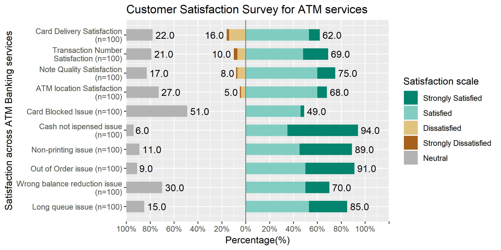

```{r}
library("knitr")  
opts_knit$set(root.dir = "../")  
opts_chunk$set(echo = FALSE)  
```

##Introduction

Computer science is entering every field now. One such example would be it entering the banking world. Since the domination of the internet, everything is going digital including the services provided by the bank. It has become very common for companies to send out surveys online. I am going to look visualize the feedback survey (done online) for the ATM and internet banking services offered. The aim is to find the pain areas in these banking services.


##Requirements
This graph satisfies the D7 requirements:
(domain specific)
Likert Survey Bar plot
observations: 100
ATM plot - y axis- satisfaction levels of various services and problems faced
x axis - Percentage based on satisfaction level chosen

Internet banking plot 
y-axis :satisfaction levels of various services and problems faced
x axis : Percentage based on satisfaction level chosen


##Prose
For both the plots I chose shades of green to show satisfaction and shades of brown to show dissatisfaction. This use of colour scheme helps differentiate between positive and negative immediately without avoiding confusion. Chose the neutral color to be grey since that is not a true indicator of customer satisfaction. I chose to extract the neutral section since in the absence of it, it becomes very easy to see which service is struggling. [@RostLC2018a]


```{r setup, echo=FALSE}
library("knitr")
include_graphics("../d7-likert-atmbanking.png")
```


*Display 1: Shows the satisfaction level of customers using ATM services*

Looking at the graph of the ATM services, we can see the services that need to be fixed. If I were a bank, I would start by fixing:
Card Delivery Service -  speed at which the cards are delivered to the  customer
Transaction Number - customers seem to be complaining about the limit on the amount of transactions per day
Note Quality - The next thing to fix would be the quality of notes dispensed by the machine
ATM location satisfaction - 5% have complained about the location of ATMs, might be worth looking into.
Also 51% replied as neutral on the card block service. This does not seem like a pressing matter but might be worth looking into to increase customer satisfaction


```{r setup2, echo=FALSE}
library("knitr")

```


*Display 2: Shows the satisfaction level of customers using Internet banking services*


Looking at the banking services graph, we can see that the following areas need work:
The account info service looks to be something that needs some work with 5% of the customers complaining about it. The rest of the services have complaints that are less than 5% so it might be worth to look at the other pressing needs.


## References
